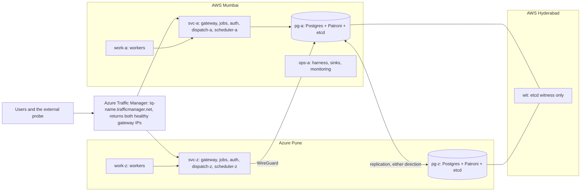

# Deployment and Availability Plan — Always On, Fully Automatic

Oct 8, 2026 · @Aniruddha Roy · companion to `full_plan(v4).md` · replaces the earlier version of this file

## The goal

> **After go-live, the service is never taken down on purpose, and any single failure is handled automatically.** A push to `release` tests, builds and deploys with zero failed requests. Database failover, OS reboots, Postgres upgrades and infrastructure changes are rolling and automatic too. You push; nothing else is manual.

### What "zero downtime" means here, precisely

| Event | Promise | Proven by |
| --- | --- | --- |
| A deploy, a config change, an OS reboot, a Postgres minor upgrade, a VM replacement | **Zero failed requests.** Requests may be slower for a few seconds. | An external probe runs throughout every rollout and fails the rollout on the first failed request |
| Any single crash: a process, a VM, a whole cloud, the link between the clouds | **Service continues automatically.** Only requests that were in flight on the failed component can fail, and clients retry those safely with the same idempotency key. | The chaos test with the probe running (week 15) |
| Two failures at once, or an outage of Traffic Manager, GitHub or both clouds | **Not promised.** No system can promise this; listed under [Known limits](#known-limits). | — |

100% uptime is not a promise anyone can make: AWS and Azure both publish SLAs below 100%. What this plan delivers is **no planned downtime, ever**, and **no single point of failure**.

---

## The architecture changes that make it possible

v4's Act 1 layout had single points of failure: one gateway, one database, DNS failover with a TTL, and manual database failover. An always-on service can't have any of them.

| Was (v4) | Now | Why |
| --- | --- | --- |
| Route 53 DNS failover with a 30 s TTL, plus a purchased domain | **Azure Traffic Manager** (paid from Azure credits, about $1–2 a month), using **MultiValue** routing, a 10 s TTL and fast health probes every 10 s. It returns **both** healthy gateway IPs. | No domain to buy: the free `tq-<name>.trafficmanager.net` name is the public address. Because clients get both IPs, a client whose first connection fails tries the second at once; browsers and Go's dialer already do this. During a deploy, a gateway's endpoint is disabled through the Azure API and the pipeline waits for DNS caches to expire before restarting it. |
| One gateway, `jobs` and `auth` in Act 1, two in Act 2 | **Two of every stateless service from week 12**, one in each cloud | Something can always be restarted while its twin serves traffic |
| A manual `make failover` | **Patroni + etcd**: automatic failover and switchover | Patroni promotes the standby only when etcd has a majority, so there is never split brain, and a primary that loses etcd demotes itself |
| Two etcd failure domains (AWS, Azure) | **Three etcd members:** `pg-a` (AWS Mumbai), `pg-z` (Azure Pune) and a **witness** (`wit`, a `t4g.nano` in AWS Hyderabad) | A majority survives losing any one site, so failover needs no human |
| Strict synchronous replication (writes stop when the standby is unreachable) | **Patroni `synchronous_mode: on`**, not strict: if the standby goes away, Patroni turns synchronous replication off and writes continue; it turns back on when the standby catches up | Strict mode stops all writes during a partition, which is downtime. Patroni promotes only a standby that was in sync, so a failover itself never loses an acknowledged job. |
| Nightly VM stop | **No nightly stop after go-live** | A stopped server is downtime |
| Infrastructure applied by hand | **Automatic `terraform apply`** on push, with rolling VM replacement | Nothing to do by hand |

### What changes in the v4 guarantees

- **G1 becomes:** "An acknowledged job is never lost unless the primary's disk is lost **while** the standby is out of sync". That is a double failure. This is the price of staying writable during a partition, and the design doc explains the trade.
- **The fault model gains:** loss of either cloud, or a cut between the clouds, is now handled automatically, without an operator.
- **Act 2's "writes stop during a partition" is gone.** The side with the etcd majority keeps the primary and keeps writing. Azure workers can't reach the database during a cut, so they idle until the link returns. Workers in AWS keep running every job.

---

## How the pieces fit



- **Clients reach the primary wherever it is.** Every service connects with `host=pg-a,pg-z target_session_attrs=read-write`, so after a failover, new connections find the new primary automatically.
- **Services retry internally.** `jobs` and `auth` retry database writes for up to 30 s, with backoff and the same idempotency key. A switchover or failover therefore shows up as a slow request, not a failed one. The gateway retries a request once on its twin in the other cloud if the first one hits a connection error. That is safe because every write carries an idempotency key.
- **Workers already handle this.** Each worker has a list of dispatchers and falls back to the other cloud's. Leases and fencing cover everything else.

---

## Release pipeline: `git push origin main:release` → live

### Branches

- **`main`:** normal development; nothing runs on push.
- **`release`:** auto-deploys.
- **Branch protection on `release`:** linear history, no force pushes, only you can push.
- **Credentials:** OIDC trust to both clouds is limited to `refs/heads/release` in the `cloud` environment, with no manual approval. GitHub stores **no secrets at all**: Traffic Manager endpoints are switched through the same Azure OIDC login.

### `release.yml`, in five automatic stages

```yaml
name: release
on:
  push: { branches: [release] }
  workflow_dispatch: { inputs: { sha: { description: "Redeploy an earlier commit", required: false } } }
concurrency: { group: deploy-cloud, cancel-in-progress: false }   # one rollout at a time, never cut short
permissions: { contents: read, packages: write, id-token: write }
jobs:
  verify: # tests -race, buf breaking vs deployed, migration compatibility, 10-min chaos smoke on Compose
  build:  # one image per binary, tag = SHA, refuse to overwrite an existing tag
  infra:  # terraform plan -> classify -> apply in place / rolling replace (see below)
  deploy: # rollout.sh: preflight, migrate, rolling drain-and-restart, smoke test, auto-rollback
  probe:  # runs alongside deploy on a GitHub runner, outside both clouds
```

### Stage 3 — infrastructure, automatically

`terraform plan` runs on every release, and each change is handled according to its kind:

| Kind of change | What the workflow does |
| --- | --- |
| No change | Nothing |
| Create, or update in place (a firewall rule, a tag, a new VM) | `terraform apply` |
| **Replace a stateless VM** (`svc-*`, `work-*`, `ops-a`) | A rolling replace, one VM at a time: drain it (Traffic Manager endpoint off, readiness off), `terraform apply -replace=<vm>`, wait until it is ready and on the current release, re-enable it, move to the next |
| **Replace a database VM** | Replace the **replica** first and wait until it is in sync. Then `patronictl switchover` to it (a few seconds of slower writes, with no failures thanks to the internal retries), and replace the old primary |
| **Destroy** a database VM, a disk or the witness, with no replacement | **The workflow refuses and emails you.** Deleting data is the one thing that is never automatic. |

### Stage 4 — `rollout.sh`, zero-downtime application deploy

1. **Preflight.** Every VM must answer a run command (AWS SSM or Azure Run Command), Patroni must report a healthy leader with a streaming replica, and no chaos run may hold the lock. If any check fails, nothing changes; the workflow waits 2 minutes and retries 3 times, then fails and emails you.
2. **Record the target.** Write `target` = the new commit, and keep `previous`.
3. **Migrate.** Expand/contract migrations only, so the old code keeps working on the new schema. A one-shot job runs them against the primary.
4. **Roll out, one VM at a time:** `ops-a`, `svc-z`, `svc-a`, `work-z`, `work-a`. On each VM, `deploy.sh` handles one service at a time:
   1. **Drain.** For a gateway, first disable its Traffic Manager endpoint, then wait 60 s: six times the 10 s TTL, so resolvers that round TTLs up also refresh. The gateway then closes idle keep-alive connections (`Connection: close`, HTTP/2 GOAWAY), so clients reconnect to its twin. For any other service, switch `/readyz` off so its twin and its callers stop sending it traffic, then wait 10 s.
   2. **Stop gracefully.** Send `SIGTERM`. Go's `Server.Shutdown` finishes in-flight requests. Workers stop claiming and finish their jobs, with `stop_grace_period` set to the longest job timeout.
   3. **Start the new version** and wait for `/readyz`, with a 120 s limit.
   4. **Re-enable** the Traffic Manager endpoint, and wait until the probe sees it healthy before moving on.

   Because each service's twin in the other cloud is serving the whole time, no request fails.
5. **Postgres, Patroni and etcd are never restarted by `docker compose`.** If their images changed, `rollout.sh` does a Patroni rolling restart: replica first, then switchover, then the old primary. etcd goes one member at a time, so it always keeps a majority.
6. **Smoke test.** Through the Traffic Manager name:
   - one job with `affinity = 'aws'` and one with `affinity = 'azure'` must succeed;
   - every `/version` endpoint must report the new commit;
   - no new dead letters may appear.

   If all passes, set `current` to the new commit.
7. **Automatic rollback.** If any step fails, or the probe records a single failed request, the same rolling procedure runs with `previous`. The workflow then fails and emails you.

### Stage 5 — the probe that proves it

While the rollout runs, a separate job on a GitHub-hosted runner, outside both clouds, sends about 10 requests per second through the Traffic Manager name, resolving DNS afresh for every request. It mixes reads with idempotent submits and **does not retry**. A single failed request fails the release and triggers rollback. This is the evidence for "zero downtime", collected on every deploy.

### VMs bring themselves up to date

`tq-converge.service` runs `deploy.sh` with `current` at every boot. The release record is kept in both SSM and Key Vault. A new, replaced or rebooted VM therefore always comes up on the right release without anyone touching it.

---

## Automatic maintenance (nothing scheduled by hand)

| Task | How | Downtime |
| --- | --- | --- |
| OS security patches | `unattended-upgrades`, with no automatic reboot | None |
| Reboots (when `/var/run/reboot-required` exists) | A weekly `maintenance.yml` reboots VMs one at a time, with the same drain, reboot, ready, next steps. Database VMs go replica first, then a switchover. | None |
| Postgres minor upgrade | Bump the image tag in the repo and push to `release`; Patroni does the rolling restart | None |
| Certificates | Both gateways use Go's `certmagic` library with **shared storage in Postgres**. They obtain and renew one Let's Encrypt certificate for the Traffic Manager name automatically, and either gateway can answer the validation request. Each gateway keeps a copy on disk, so a database outage doesn't affect TLS. | None |
| Unhealthy VM | The `maintenance.yml` health sweep (every 15 minutes) replaces any VM whose health check has failed for 10 minutes, using the rolling replace | None, because its twin serves meanwhile |
| Uptime monitoring | Traffic Manager's health-probe history, plus a probe workflow on a GitHub-hosted runner every 15 minutes that emails you on failure | — |

---

## Pre-production vs production

The cloud can't be both always-on and deliberately broken by experiments that cause downtime. So there are two periods:

| | Weeks 10–13: pre-production | From week 14: production (go-live) |
| --- | --- | --- |
| Downtime allowed | Yes. This is when Act 1's fragility experiments run. | **No** |
| Nightly stop | Yes, to save credits | **No.** VMs run 24/7. |
| Chaos in the cloud | Any fault, including stopping a whole cloud | Only faults the design survives without downtime (kill a VM, pause a worker, cut the clouds apart, stop a whole cloud). These now prove availability as well as safety. |
| Faults that would cause downtime | Allowed | Local Compose only |

**Go-live gate (end of week 13):** five rollouts in a row with zero failed probe requests, plus automatic failover passing in both directions, and the partition and witness-loss scenarios.

---

## Cost — the honest numbers

Running all 8 VMs 24/7 costs more than running them on demand. These are estimates; replace them with pricing-calculator figures in week 10.

| | Pre-production (weeks 10–13, nightly stop) | Production (24/7) |
| --- | --- | --- |
| AWS: 5 VMs (`svc-a`, `work-a`, `pg-a`, `ops-a`, `wit`) on `t4g.small`/`nano`, plus IPv4 and disks | ~$1.5/day | ~$3–4/day |
| Azure: 3 VMs, B1-series | ~$1/day | ~$1.5–2/day |
| Azure Traffic Manager (2 endpoints, fast probing, DNS queries) | ~$1–2/month | ~$1–2/month, **from Azure credits** |

- **Through week 16 (3 production weeks):** AWS ≈ $40 + $70 = ~$110 of $200; Azure ≈ $25 + $40 = ~$65 of **$86**. That fits, but Azure is tight. The 80% Azure budget alert is a tripwire: if it fires, shrink `work-z` first.
- **If Azure credits run out,** Azure for Students disables the subscription. The system is built to survive losing a cloud, so it keeps serving from AWS automatically, without its synchronous standby. That is degraded, but not down.
- **After week 16,** staying always-on costs real money: roughly **$140–180 a month** once credits are gone. Decide at week 16 whether to keep it running, shrink it, or tear it down.

---

## Files

```text
.github/workflows/ci.yml            every push to release: vet, -race tests, codegen check, govulncheck, proto breaking
.github/workflows/release.yml       push to release: verify, build, infra, deploy, probe
.github/workflows/maintenance.yml   weekly rolling reboots, 15-minute health sweep
deploy/release/rollout.sh           drain, deploy, smoke test, rollback (application)
deploy/release/infra.sh             plan classification and rolling replace (infrastructure)
deploy/release/probe/               the external no-retry probe
deploy/vm/deploy.sh                 per-VM converge, called by rollout and at boot
deploy/vm/<role>.compose.yml        one Compose file per role, versioned with the code
deploy/vm/patroni.yml               Patroni configuration (synchronous_mode: on)
```

---

## When it gets built (replaces v4's weeks 9–15)

| Week | Work | Done when |
| --- | --- | --- |
| 9 | Locally: Patroni + 3-member etcd in Compose, with `tc netem` latency; internal retries in `jobs` and `auth` | Kill the primary while the chaos run is going: automatic failover, zero acknowledged jobs lost, no failed probe requests beyond those in flight |
| 10 | Infrastructure (both stacks, mesh, witness), Traffic Manager, certmagic TLS, `release.yml` with verify, build and deploy | A push to `release` deploys in place; a broken release rolls back on its own |
| 11 | Act 1 layout in the cloud, plus the fragility experiments (pre-production, so downtime is allowed) | `docs/results/act1-fragility.md` |
| 12 | Act 2 stateless tier in both clouds, the drain protocol, the probe stage | Five rollouts in a row with zero failed probe requests |
| 13 | Patroni across clouds, automatic infrastructure stage, `maintenance.yml`; **go-live gate** | Automatic failover AWS→Azure and back; partition and witness-loss scenarios; a rolling replace of a database VM, all with no failed requests beyond in-flight ones |
| 14–15 | **Production.** Full survivable chaos with the probe running, cloud load tests, cost + buffer | `docs/results/act2-resilience.md` with availability numbers |
| 16 | Ship (design doc, video); decide whether to keep it running | — |

---

## Known limits

- **A component that crashes takes its in-flight requests with it.** Clients retry with the same key and succeed on the twin. "Zero failed requests" is promised for planned events only.
- **A double failure can lose data or availability.** Losing the primary's disk while the standby is out of sync loses the acknowledged jobs from that window. Losing two of the three etcd sites stops automatic failover.
- **Provider outages:** Azure Traffic Manager (the public name stops resolving, even though AWS is fine), GitHub (deploys pause; the running service is unaffected) and both clouds at once.
- **DNS caching:** a client that ignores TTLs and also keeps only one IP can still reach a stopped gateway after a crash. Clients that keep both IPs (browsers, Go) fall back immediately. For planned events, the 60 s drain covers resolvers that round TTLs up.
- **Certificate issuance:** the Let's Encrypt rate limit for `trafficmanager.net` may be shared with other Azure customers. The certificate is issued once and only renewed every 60 days, which keeps that risk small. If it is hit anyway, the fallback is a free domain from the GitHub Student Developer Pack.
- **The witness is in AWS** (another region). An outage across all of AWS takes two of the three etcd votes, so the Azure side cannot promote itself. A witness on a third provider fixes this, at extra cost; that is a stretch goal.
- **Destroying stateful resources is never automatic.** The pipeline refuses and emails you. This is deliberate.
