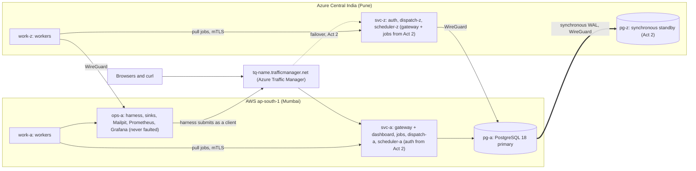

# Distributed Job Scheduler — v4: Go Services Across AWS + Azure

Oct 8, 2026 · @Aniruddha Roy

## The claim

> **A distributed job scheduler running across AWS and Azure that never loses a job it has acknowledged and never records a job's result twice. Each job's effect happens at most once, and exactly once if the job succeeds, at every destination that checks the job's effect key. This holds through worker crashes and pauses, scheduler failover, database restarts, a full AWS–Azure network split and, from go-live (week 14), the loss of either cloud, all handled automatically. Planned work (deploys, upgrades, reboots) never takes the service down. An automated test checks every guarantee, and a deliberately broken build proves that each check can fail.**

The [fault model](#fault-model) and the [guarantees](#guarantees) define every word of that sentence. Anything they leave out is listed under [Known limits](#known-limits), on purpose. Every part of this plan serves the claim; anything that doesn't is a stretch goal.

**Timeline:** 16 weeks part-time, assuming about 12–15 hours a week. Weeks 6, 9 and 15 include buffer; week 16 is polish. If a week slips, a weekly checkpoint and a pre-ordered [cut list](#scope-control) decide what goes, so the plan shrinks rather than fails.

---

## Fault model

**Tolerated.** Every safety guarantee (G1–G4, G6–G8) holds through any combination of the following:

- a crash (`kill -9`) of any process at any instruction, or a VM stop or reboot;
- a pause of any length in any process or VM (GC, `SIGSTOP`, a frozen VM);
- lost, delayed, duplicated or reordered messages, and any network partition, up to a full AWS–Azure split;
- a PostgreSQL restart;
- a wrong clock anywhere, including a step on the database host (see [One clock](#one-clock));
- **from Act 2:** the loss of either database node, of either whole cloud, or of the etcd witness, recovered automatically by Patroni (see `deployment_plan.md`).

**Not tolerated** (out of scope, and stated in the design doc):

- In Act 1, loss of the primary database's disk. In Act 2, loss of the primary's disk while the standby is out of sync, or loss of two of the three etcd sites (both double failures).
- Operator mistakes (a dropped table, a wrong setting) and bugs that write wrong values.
- Malicious workers. A worker holding a valid certificate can report success without doing the work, so workers count as trusted code.
- Side effects sent to systems that don't check the effect key. The `email.send` workload exists to demonstrate this case.
- An outage of Azure Traffic Manager, or of GitHub (deploys pause; the running service is unaffected).

**Liveness (G5) needs more than safety does.** A job makes progress only when all of these are true:

- a worker that serves the job's queue and type is running;
- that worker can reach a dispatcher;
- that dispatcher can reach the database primary;
- some scheduler can also reach the primary, because the scheduler requeues expired leases.

In Act 2, failover is automatic as long as two of the three etcd sites can reach each other. **Safety never waits on liveness.**

---

## Guarantees

Exactly-once *execution* is impossible: a worker can always crash after doing the work but before reporting it. The scheduler therefore gives **at-least-once execution** plus **effect keys** that let each effect happen once, and it says so plainly.

| # | Guarantee | How | Checked by |
| --- | --- | --- | --- |
| G1 | **Durable acknowledgement.** An acknowledged job is never lost. | The API acknowledges a job only after `COMMIT` succeeds. With Patroni's synchronous mode (week 9 locally, week 13 in the cloud), a commit is on disk in both places before it returns while the standby is in sync. If the standby is unreachable, Patroni switches to asynchronous replication to keep writes available, and it only promotes a standby that was in sync. Any error or timeout after `COMMIT` is sent returns `503 outcome unknown`, and the client retries with the same key. A cancelled synchronous commit may be committed locally without being replicated, so it is never reported as a success. | Chaos checker: every job ID in the harness's fsynced acknowledgement log exists in the database, including after a failover. |
| G2 | **Idempotent submission.** The same owner and key always return the same job. Reusing a key with a different request returns `409`. | `UNIQUE (owner_id, idempotency_key)`. The original request is stored as `jsonb` and compared with `=`, which ignores key order and whitespace. The key is required. | About 10% of harness submissions repeat a key, some with a changed body. Checker: one job per key, and every repeat got the original ID or a `409`. |
| G3 | **One recorded result.** Two workers may run the same job at once (one paused past its lease), but only the holder of the current lease token can heartbeat, complete or fail it. | Each attempt gets a random `lease_token`, checked inside the same `UPDATE` that changes the job. A retried complete or fail that already committed is recognised through `job_attempts`. | Checker: each job has at most one `succeeded` attempt, and it is the last attempt. Rejected late completions are counted, and the count must be above zero. |
| G4 | **Effects at most once, and exactly once on success,** at sinks that check the effect key. | The effect key is `owner_id:idempotency_key`, so it survives a resubmission. The sink stores the key in the same transaction as the effect, and a handler treats "already applied" as success. | Checker, per sink: at most one applied effect per key, exactly one for each succeeded job, and absorbed duplicates counted (must be above zero). For the ledger, each account's balance equals its opening balance plus its recorded transfers, and those transfers match the transfer jobs one for one. |
| G5 | **Liveness.** Every job ends `succeeded`, `dead` or `cancelled`. | Leases expire on database time, the reaper requeues expired jobs, `max_attempts` caps retries, and every attempt has a hard deadline. | After quiesce, no job is `available` or `running` with `run_at` in the past. |
| G6 | **Cron exactly once.** Every tick of an unpaused schedule produces exactly one job, and no tick is skipped. | Each tick is a row with `PRIMARY KEY (schedule_id, tick_at)`, inserted in the same transaction as its job. Missed ticks are caught up. | The checker recomputes each schedule's expected ticks from its cron expression and time zone and compares them one to one. Unit tests cover DST changes. |
| G7 | **One leader per epoch.** A stale leader's chore writes are rejected. G1–G6 don't depend on G7; G7 only prevents wasted work. | The leader lease row carries an `epoch`, and every chore transaction starts by locking that row with `FOR SHARE` at the expected epoch. | From `chore_runs`, every chore of epoch *e* committed before any chore of a later epoch started. |
| G8 | **Order where promised.** No attempt starts before its `run_at`. Among the jobs a worker may take, a claim takes higher priority first. | The claim query, using only the database clock. | Checker: `started_at ≥ run_at` for every attempt. A deterministic test (one worker, mixed priorities) checks priority order. |

**Isolation:** a user can only see and change their own jobs. Integration tests check this from week 2.

### One clock

Every lease, deadline, `run_at` and tick uses Postgres `now()`, never a VM's clock. Clocks in AWS and Azure drift, and one authoritative clock removes a whole class of bugs.

The stronger point is that **no safety guarantee depends on any clock.** A wrong clock changes only timing: leases expire early or late, and ticks fire early or late. Fencing tokens and effect keys absorb the consequences.

Two narrower uses of time remain:

- App VMs read wall-clock time only to check JWT expiry, with 60 seconds of leeway and chrony running everywhere.
- After a failover, the new primary's clock takes over. The skew between the two database hosts is milliseconds, and leases are measured in seconds.

This deserves its own section in the design doc.

---

## Key decisions

- Postgres `SELECT … FOR UPDATE SKIP LOCKED` instead of a message broker, the project's central opinion. Where it stops scaling is measured in week 9.
- Any dispatcher can claim jobs; the leader only runs singleton chores.
- Workers talk only to `dispatch`, so database credentials never leave the service tier.
- Per-job lease tokens and a leader epoch, both used as fencing tokens.
- Idempotent submission, effect keys and exactly-once cron are core features, not stretch goals.
- One repository, one Go module, one binary per service, and a single `job_attempts` table.
- One clock, the database's.

---

## Architecture

### Services (Go unless noted)

| Service | Job | Owns |
| --- | --- | --- |
| `gateway` | The only public entry point: TLS, routing, JWT check, per-user rate limit and a 64 KB body limit. Also serves the dashboard's static files. | Nothing |
| `auth` | Login, JWT issuing (EdDSA with a `kid`), JWKS. Registration is admin-only. | Database `auth` |
| `jobs` | The public job API: submit, get, list, cancel, redrive, and CRUD for schedules | Database `jobs`, shared with `dispatch` and `scheduler` |
| `dispatch` | Worker-facing gRPC: long-poll claim, heartbeat, complete, fail; keeps the `nodes` registry | Same database |
| `scheduler` | Chores run by the elected leader: cron ticks and the lease reaper | Same database |
| `worker` | Runs handlers written with the Go worker SDK | Nothing (talks only to `dispatch`) |
| `dashboard` | Next.js 16 static export showing live jobs, queues, workers per cloud, dead letters, schedules, and the leader and its epoch | Nothing (served by `gateway`, talks only to `gateway`) |
| `sinks` | Test destinations: the ledger, a webhook receiver and a digest store | Its own Postgres on `ops-a` |
| `torture` | The chaos harness and its checker | Its acknowledgement log |
| `chaosagent` | Runs on each system VM; applies a fault for a fixed time, then reverts it on its own | Nothing |

`jobs`, `dispatch` and `scheduler` are **three processes of one bounded context**. They share the `jobs` database on purpose, because claiming a job must be one transaction; say so openly in the design doc. `auth` is a separate context with its own database and credentials. Both databases live in one PostgreSQL cluster so there is a single failover story, and each service's database role can reach only its own database. This decision gets a page in `docs/decisions/`.

### Contracts

- **Worker API:** Protobuf with [connect-go](https://connectrpc.com/). Workers use gRPC over mTLS, and the same handler speaks Connect's HTTP/JSON for `curl` on the private network. Nothing public can reach it. `buf lint` and `buf breaking` run in CI.
- **Public API:** REST/JSON, through the gateway only.
- **One round trip:** every claim, heartbeat and completion is a single SQL statement. This matters once a dispatcher sits in a different cloud from the database.

### Security

- **Public surface:** only the gateways' port 443, published as `tq-<name>.trafficmanager.net` with an automatic Let's Encrypt certificate, plus WireGuard's UDP port between mesh peers. There is no public SSH; admin access goes over the mesh, with your laptop as one of the peers.
- **Authentication:** EdDSA-signed JWTs that expire after 60 minutes. Services that verify tokens:
  - accept only the expected signing algorithm;
  - fetch the JWKS (the public keys) with retries;
  - reject every request until they have it (fail closed).

  Passwords are hashed with argon2id, and logins are rate-limited.
- **Browser sessions:** browsers get the token in an `HttpOnly; Secure; SameSite=Strict` cookie. Any cookie-authenticated request that changes state must carry a matching `Origin` header.
- **Authorization:** `owner_id` comes from the verified token's `sub` claim on every query, never from the request body. Another user's job returns `404`.
- **Internal traffic:**
  - mTLS from a project certificate authority on every internal call;
  - TLS required for Postgres (`sslmode=verify-full`);
  - WireGuard encrypting everything between the clouds.
- **Input validation:**
  - queue and type names must match `^[a-z0-9._-]{1,64}$`;
  - user keys can't start with `cron:`, which is reserved for the scheduler;
  - `webhook.deliver` posts only to allowlisted receivers, which prevents server-side request forgery;
  - EC2 instances require IMDSv2.
- **Abuse:** registration is off in the cloud (users are seeded), and rate limits apply per user.
- **Secrets:** Terraform generates them, stores them in SSM Parameter Store (AWS) and Key Vault (Azure), and each VM reads them at boot using its own identity. No secrets are in the repository, and logs never contain tokens or payloads. The Terraform state contains secrets, so its bucket is private, encrypted and versioned.
- **CI:** GitHub OIDC grants cloud access only to `repo:aniruddha81/task-queue` on the `release` branch in the `cloud` environment. Pull requests get no cloud credentials.

### Data model (`jobs` database)

```sql
-- PostgreSQL 18 (uuidv7() is new in 18). A sketch: migrations/ is the source of truth.
CREATE TABLE jobs (
  id               uuid PRIMARY KEY DEFAULT uuidv7(),   -- no counters: safe across replication
  owner_id         uuid NOT NULL,                       -- from the verified JWT, never the body
  idempotency_key  text NOT NULL,                       -- required; 'cron:' prefix reserved
  request          jsonb NOT NULL,                      -- original request, for G2's 409
  queue            text NOT NULL,
  type             text NOT NULL,
  payload          jsonb NOT NULL,
  priority         int  NOT NULL DEFAULT 0,
  run_at           timestamptz NOT NULL DEFAULT now(),
  state            text NOT NULL DEFAULT 'available'
                   CHECK (state IN ('available','running','succeeded','dead','cancelled')),
  cancel_requested boolean NOT NULL DEFAULT false,
  attempt          int  NOT NULL DEFAULT 0,
  max_attempts     int  NOT NULL DEFAULT 5 CHECK (max_attempts >= 1),
  timeout_seconds  int  NOT NULL DEFAULT 60 CHECK (timeout_seconds BETWEEN 1 AND 3600),
  affinity         text CHECK (affinity IN ('aws','azure')),
  lease_token      uuid,
  lease_expires_at timestamptz,
  deadline_at      timestamptz,
  node_id          uuid,
  last_error       text,
  created_at       timestamptz NOT NULL DEFAULT now(),
  updated_at       timestamptz NOT NULL DEFAULT now(),
  finished_at      timestamptz,
  UNIQUE (owner_id, idempotency_key),
  -- a lease exists exactly while the job is running
  CHECK ((state = 'running') = (lease_token IS NOT NULL AND lease_expires_at IS NOT NULL))
);
CREATE INDEX jobs_claim  ON jobs (queue, priority DESC, run_at) WHERE state = 'available';
CREATE INDEX jobs_leases ON jobs (lease_expires_at)             WHERE state = 'running';

CREATE TABLE job_attempts (
  job_id      uuid NOT NULL REFERENCES jobs (id),
  attempt     int  NOT NULL,                 -- never reused: redrive raises max_attempts
  lease_token uuid NOT NULL UNIQUE,
  node_id     uuid NOT NULL,
  started_at  timestamptz NOT NULL,
  finished_at timestamptz,
  outcome     text CHECK (outcome IN ('succeeded','failed','lease_expired','cancelled')),
  error       text,
  PRIMARY KEY (job_id, attempt)
);

-- nodes(id, name, cloud, queues text[], types text[], version, last_seen_at)
-- schedules(id, owner_id, name, cron, timezone, template jsonb, paused, next_tick_at, created_at)
--   cron and timezone are fixed at creation; a different cadence is a new schedule
-- schedule_ticks(schedule_id, tick_at, job_id NOT NULL REFERENCES jobs,
--                PRIMARY KEY (schedule_id, tick_at))
-- leader_leases(name PRIMARY KEY, holder, epoch bigint NOT NULL, expires_at NOT NULL)
--   seeded by the migration with expires_at = '-infinity'
-- chore_runs(epoch, chore, started_at, committed_at)   -- evidence for G7
```

**State machine:**

- `available → running` when a worker claims the job.
- `running → succeeded` on complete.
- `running → available` on a failure or an expired lease, while attempts remain, after a backoff delay.
- `running → dead` when attempts run out or the error is marked permanent.
- `running → cancelled` once a requested cancel takes effect.
- `available → cancelled` on cancel.
- `dead → available` on redrive.

The database's `CHECK` constraints refuse any row that doesn't fit these states.

### The core queries

```sql
-- claim: any dispatcher, any cloud. One statement.
WITH next AS MATERIALIZED (
  SELECT id FROM jobs
  WHERE state = 'available' AND run_at <= now()
    AND queue = ANY($queues) AND type = ANY($types)
    AND (affinity IS NULL OR affinity = $cloud OR run_at <= now() - $steal_after)  -- 30 s
  ORDER BY priority DESC, run_at, id
  LIMIT $n
  FOR UPDATE SKIP LOCKED
), claimed AS (
  UPDATE jobs j
  SET state = 'running', attempt = j.attempt + 1, lease_token = gen_random_uuid(),
      node_id = $node, updated_at = now(),
      deadline_at      = now() + make_interval(secs => j.timeout_seconds),
      lease_expires_at = now() + LEAST($lease, make_interval(secs => j.timeout_seconds))
  FROM next
  WHERE j.id = next.id AND j.state = 'available'   -- re-check: no double claim under any plan
  RETURNING j.*
), logged AS (
  INSERT INTO job_attempts (job_id, attempt, lease_token, node_id, started_at)
  SELECT id, attempt, lease_token, node_id, now() FROM claimed
)
SELECT * FROM claimed;

-- heartbeat: extends the lease, never past the deadline. No row → lease lost: the SDK cancels the handler.
UPDATE jobs SET lease_expires_at = LEAST(now() + $lease, deadline_at), updated_at = now()
WHERE id = $id AND lease_token = $token AND state = 'running' AND deadline_at > now()
RETURNING cancel_requested;

-- complete: fenced. A stale worker changes nothing.
WITH done AS (
  UPDATE jobs SET state = 'succeeded', finished_at = now(), updated_at = now(),
                  lease_token = NULL, lease_expires_at = NULL
  WHERE id = $id AND lease_token = $token AND state = 'running'
  RETURNING id, attempt
)
UPDATE job_attempts a SET outcome = 'succeeded', finished_at = now()
FROM done WHERE a.job_id = done.id AND a.attempt = done.attempt
RETURNING a.job_id;
-- no row → SELECT outcome FROM job_attempts WHERE lease_token = $token:
--   'succeeded' → a retry of a complete that already committed: return OK
--   otherwise   → LEASE_LOST (the late, fenced completion the chaos test counts)

-- submit
INSERT INTO jobs (owner_id, idempotency_key, request, queue, type, payload, ...)
VALUES (...)
ON CONFLICT (owner_id, idempotency_key) DO NOTHING
RETURNING *;
-- no row → SELECT the existing job: request = $request (jsonb equality) → return it; else 409

-- leader: take over an expired lease (bumps the epoch)
UPDATE leader_leases SET holder = $me, epoch = epoch + 1, expires_at = now() + $ttl
WHERE name = 'scheduler' AND expires_at < now()
RETURNING epoch;

-- leader: renew every ttl/3. A failed renewal stops all chores at once.
UPDATE leader_leases SET expires_at = now() + $ttl
WHERE name = 'scheduler' AND holder = $me AND epoch = $epoch AND expires_at > now();

-- first statement of every chore transaction. No row → roll back and step down.
-- FOR SHARE blocks a takeover until this chore commits, so epochs never overlap.
SELECT 1 FROM leader_leases
WHERE name = 'scheduler' AND holder = $me AND epoch = $epoch AND expires_at > now()
FOR SHARE;
```

The remaining operations, in prose:

- **Fail** uses the same token fencing and the same retry rule as complete. The job becomes `cancelled` if a cancel was requested. It becomes `dead` if attempts are used up or the error is permanent. Otherwise it returns to `available`, with `run_at = now()` plus a capped exponential backoff with full jitter.
- **Reaper:** a single statement shaped like the claim. It selects expired `running` rows with `SKIP LOCKED` (500 at a time) and applies the same outcome rules as fail. It also clears the token and marks the attempt `lease_expired`. Several copies can run at once safely, which is why it can ship in week 4, before leader election exists.
- **Cancel:** an `available` job becomes `cancelled` at once. A `running` job gets `cancel_requested`; the worker sees it on its next heartbeat, stops, and the job ends `cancelled`. If the job completes first, it stays `succeeded`, and the cancel reports that it was too late.
- **Redrive** works only from `dead`. It sets the job back to `available` and raises `max_attempts` to `attempt` plus the original retry budget. Effects from earlier attempts stay deduplicated, because the effect key doesn't change.
- **Cron:** in one transaction, the scheduler locks a due schedule, inserts its job (key `cron:<schedule_id>:<tick_at>`, `run_at = tick_at`) and its tick row, and advances `next_tick_at` using the cron library's `Next()` in the schedule's time zone. Missed ticks are all created; catch-up is unbounded by design. A paused schedule produces no ticks, and on resume it starts from the first tick after `now()`.
- **Wake-up:** a submit sends `NOTIFY`, and dispatchers also poll every 1 s. Correctness never depends on a notification arriving.
- **Session hygiene:** `idle_in_transaction_session_timeout = 10s` and TCP keepalives. A paused or dead client therefore releases its row locks within seconds.

### Placement: roles in containers, VMs per cloud

| VM | Cloud | Act 1 roles | Added in Act 2 |
| --- | --- | --- | --- |
| `svc-a` | AWS | gateway (+ dashboard), jobs, dispatch-a, scheduler-a | auth (the stateless tier is duplicated from week 12) |
| `work-a` | AWS | workers | — |
| `pg-a` | AWS | PostgreSQL 18 primary (databases `jobs` and `auth`) | — |
| `ops-a` | AWS | harness, sinks (with their own Postgres), Mailpit, Prometheus, Grafana. **Never faulted.** | — |
| `svc-z` | Azure | auth, dispatch-z, scheduler-z | gateway (+ dashboard), jobs |
| `work-z` | Azure | workers | — |
| `pg-z` | Azure | — | PostgreSQL 18 + Patroni + etcd (synchronous standby) |
| `wit` | AWS Hyderabad | — | etcd witness only (`t4g.nano`) |

Every system VM (all except `ops-a`) also runs `chaosagent`.



**How they cooperate:**

- You sign in and submit through the gateway in AWS. From Act 2, Traffic Manager returns the IPs of both healthy gateways, and your client uses whichever answers.
- Workers in both clouds pull from their local `dispatch`, which claims from the primary. For Azure, that claim crosses the mesh.
- A job with `affinity = 'azure'` waits 30 s for an Azure worker before any worker may take it.
- The leader scheduler can run in either cloud.

**Quotas:** one Terraform variable maps roles to VMs. The default layout uses 4 AWS VMs (8 vCPU on 2-vCPU instances) and at most 3 Azure VMs (no more than 6 vCPU, the student quota). If a quota is tighter, the map puts more roles on fewer VMs; the roles stay separate containers either way.

### Deployment

- **Images:** one image per binary, built in CI and pushed to GHCR (public), tagged with the git SHA. The gateway image includes the dashboard's static export.
- **Terraform** has two stacks:
  - `persistent`, applied once: state bucket, DNS zone, certificate, Key Vault, OIDC roles, budgets.
  - `session`, applied at the start of each cloud phase: VMs, IPs, mesh, firewall rules. VMs stop every night and persist between working sessions.

  The persistent stack starts with local state and then migrates it into its own bucket. State lives in S3, versioned and encrypted, with `use_lockfile = true` (Terraform 1.11 or later). The Key Vault lives in the persistent stack because soft-delete keeps a deleted vault's name reserved, so per-session vaults would collide.
- **VMs:** Ubuntu LTS with Docker. cloud-init only bootstraps the VM and contains no version, so a new commit never replaces a VM.
- **Releases:** a push to `release` tests, builds and deploys in place, one VM at a time, with automatic rollback. At every boot, each VM converges to the current release. Full design in `deployment_plan.md`.
- **Migrations:** expand/contract only, run once per release by a one-shot container on `ops-a`. Services report not-ready until the schema version matches theirs.
- **Mesh:** WireGuard keys come from Terraform. Each system VM peers directly with the other cloud's VMs over static public IPs, with an MTU of 1380. The firewalls allow only the WireGuard UDP port from those IPs, plus 443 on gateways.

---

## Demo workloads (they make the guarantees visible)

| Job type | Does | Checks the effect key? | Exercises |
| --- | --- | --- | --- |
| `ledger.transfer` | Moves credits between two accounts in the ledger | Yes, in the same transaction as the transfer | G4's oracle: the per-key and per-account checks |
| `webhook.deliver` | POSTs to the test receiver (allowlisted URLs only), which fails at random either before or after recording the request | Yes, through the `Idempotency-Key` header | Retries, backoff, dead letter, redrive, absorbed duplicates |
| `report.daily` (cron) | Writes a digest row to the sinks | Yes | G6 |
| `email.send` | Sends through Mailpit, with `Message-ID` derived from the effect key | **No.** SMTP has no idempotency. | The honest counterexample: duplicate deliveries are counted and reported, never explained away |
| `chaos.*` | Sleeps (optionally with an affinity), fails, overruns its deadline, or crashes its own worker | — | G3, G5, deadlines, the affinity steal |

---

## The chaos test (the centerpiece)

`cmd/torture` runs in four steps, against either the local Compose stack or the cloud.

1. **Load:** the harness submits thousands of mixed jobs through the gateway, as a real client would.
   - About 10% are resubmitted with the same key, and some of those have a changed body and must get `409`.
   - Schedules tick throughout.
   - Each acknowledgement is appended to the acknowledgement log and fsynced before it counts.
2. **Faults:** faults follow a random timetable generated from a seed. Each fault has a set duration, and whatever applied it reverts it: Docker locally, `chaosagent` in the cloud. A crashed harness therefore never leaves a fault in place. The faults are:
   - `kill -9` on any service process, which is restarted when the fault's duration ends;
   - **pause** (`SIGSTOP` / `docker pause`) a worker past its lease, a dispatcher in the middle of a claim, or the leader in the middle of a chore;
   - restart the Postgres primary, and in Act 2 also kill it (automatic failover), stop or pause the standby, or stop the witness;
   - cut network links: `docker network disconnect` locally, and in the cloud, dropping traffic between the two clouds' system VMs.

   Stopping a whole cloud and failing the database over are scripted scenarios (weeks 12 and 14). They run with the same load and the same checker.
3. **Quiesce:** revert every fault, then wait until no due job is unfinished and every due cron tick exists. The limit is 10 minutes; exceeding it fails G5.
4. **Check:** verify G1–G8 against three independent sources:
   - the harness's acknowledgement log;
   - the jobs database (jobs, attempts, ticks, chore runs);
   - the sinks (their own Postgres, plus Mailpit's API).

   The report gives pass or fail for each guarantee, plus **how many times that guarantee's fault was exercised**. If a guarantee's fault never fired, the guarantee fails, because nothing was proven. The report is saved to `docs/results/`.

**Testing the tester:** a checker that always passes proves nothing. For each mechanism there is a mutant build (`-tags mutant_<name>`) that removes it:

- lease-token fencing;
- idempotency-key uniqueness;
- the ledger's effect-key check;
- tick uniqueness;
- the leader's epoch fence;
- acknowledging only after the commit.

Every mutant must fail the checker. If a mutant can't be caught, either the fault mix lacks a case (add it) or the mechanism isn't needed (delete it). Record which in `docs/bugs.md`.

**Reproducing failures:** the seed reproduces the fault timetable but not the exact interleaving. A failure is reproduced by rerunning that seed in a loop, with structured logs from every VM (job ID, attempt and token prefix).

**Safety versus liveness:** under a partition, *liveness* may suffer. In Act 1, Azure workers starve. In Act 2, the side with the etcd majority keeps serving, and the cut-off side's workers idle. *Safety* must never break: nothing is lost and nothing is duplicated. The report shows the two separately. It is the most important distinction in distributed systems, and this project demonstrates it.

---

## Weekly plan

### Phase A — Core, all local (weeks 1–6)

**Week 1 — Foundations and early checks**
- `git init`, a public GitHub repository, the Go module (version pinned in `go.mod`), `buf` with the worker API proto, `goose` migrations per database, Compose with PostgreSQL 18, and a Next.js 16 skeleton with static export.
- CI runs:
  - `go vet` and `go test -race`;
  - integration tests against a PostgreSQL 18 service container;
  - `buf lint`, plus `buf breaking` from the first merged proto onward;
  - `govulncheck`;
  - the web build.
- Accounts:
  - Record credit amounts and expiry dates. AWS free-plan accounts end after 6 months.
  - Record Azure for Students' allowed regions and both clouds' vCPU quotas.
  - File any quota increase now; they can take days.
  - Turn on budget alerts, and confirm that Azure's spending limit is on.
- Measure the round-trip time between AWS Mumbai and Azure Central India using the two smallest VMs for ten minutes, then destroy them. Week 9's local setup uses this number.
- *Done when:* CI is green on a pull request; `docker compose up` brings up Postgres and an empty service; `docs/results/accounts.md` records credits, expiry dates, quotas, allowed regions and the measured round-trip time.

**Week 2 — Job API and data model**
- `jobs`: submit (required key, `409` on a changed request), get, list with keyset pagination, and cancel. `owner_id` comes from a verified JWT; a development key is used until week 6.
- The schema with its constraints, `job_attempts`, and UUIDv7 IDs.
- *Done when:*
  - table-driven tests cover every state transition, and the database's constraints refuse illegal ones;
  - 50 concurrent identical submits create exactly one job;
  - a changed body gets `409`;
  - user B gets `404` for user A's job.

**Week 3 — Dispatch, leases, worker SDK**
- `dispatch`:
  - long-poll claim using the query above;
  - 30 s leases, with heartbeats that stop at the deadline;
  - idempotent complete and fail;
  - the `nodes` registry;
  - wake-ups through `LISTEN/NOTIFY`, with a 1 s poll as fallback;
  - session timeouts and keepalives on every connection pool.
- Worker SDK:
  - a handler registry, so a worker claims only the types it registered;
  - one batched heartbeat per worker, timed with the monotonic clock;
  - the handler's context is cancelled on lease loss, deadline or a cancel request;
  - a list of dispatchers with fallback;
  - graceful drain on `SIGTERM`.
- Add metrics as each piece lands.
- *Done when:*
  - the concurrency test (5 workers, 1,000 jobs, exactly one attempt per job) passes 20 times in a row under `-race`;
  - a stale token is rejected;
  - a complete retried after a dropped response returns OK.

**Week 4 — Reliability features**
- Retries with capped exponential backoff and full jitter, with permanent errors going straight to dead letter.
- Deadlines.
- The lease reaper, which is safe with any number of copies running.
- Dead letter and redrive, delayed jobs, priorities, and cooperative cancel.
- *Done when:*
  - tests prove each feature;
  - a job that always fails and a job that crashes its worker every time both end `dead` after exactly `max_attempts`;
  - the priority-order test passes;
  - two reapers racing each other never requeue the same job twice.

**Week 5 — Leader election and cron**
- Leader election: lease plus epoch, the `FOR SHARE` fence in every chore transaction, and `chore_runs`. The reaper moves under the leader.
- Cron:
  - CRUD for schedules, with cron expression and time zone fixed at creation;
  - each tick and its job written in one transaction;
  - catch-up for missed ticks;
  - `time/tzdata` embedded in the binary.
- *Done when:*
  - with two schedulers, killing or pausing the leader hands over within the lease TTL, and the paused leader's next chore is rejected;
  - across 100 forced handovers, no tick is duplicated or skipped;
  - tests for both DST transitions (spring forward and fall back) pass.

**Week 6 — Auth, gateway, internal TLS + buffer**
- `auth`: login, JWTs, JWKS, seeded users, admin-only registration.
- `gateway`: routing, JWT check, rate limit, body limit, the static dashboard, the browser cookie and its `Origin` check.
- A project certificate authority, created by a script locally and by Terraform in the cloud. mTLS on every internal call; Postgres over TLS.
- *Done when:*
  - tests reject missing, expired, wrong-key and `alg: none` tokens;
  - `dispatch` refuses a client without a certificate;
  - the whole local stack runs over TLS.

### Phase B — Prove it locally (weeks 7–9)

**Week 7 — Sinks, chaos harness, checker**
- `sinks`, with its own Postgres: the ledger, a webhook receiver that fails at random (before or after recording), and a digest store. Mailpit handles email.
- A handler for every demo workload.
- `cmd/torture`: load, seeded faults, quiesce, check and report. Plus the mutant builds.
- *Done when:*
  - the clean build passes G1–G8 through kills, pauses, Postgres restarts and network cuts, with every fault count above zero;
  - every mutant build fails the checker.

**Week 8 — Dashboard and metrics**
- Dashboard pages:
  - jobs, filtered by state and queue;
  - job detail with its attempt history;
  - queues, and workers per cloud;
  - dead letters with redrive;
  - schedules;
  - the current leader and its epoch.

  It polls every 2 s.
- A Grafana board showing claims per second, queue depth, lease expiries, retries, latency histograms and replication lag.
- *Done when:*
  - killing a worker is visible live, from lease expiry to another worker finishing the job;
  - a paused worker's rejected completion appears in that job's attempt history.

**Week 9 — Local automatic failover, load baseline + buffer**
- Compose gains Patroni with a 3-member etcd and a second Postgres node, with `tc netem` adding week 1's round-trip time between them. `synchronous_mode: on` (not strict).
- `jobs` and `auth` retry database writes internally for up to 30 s with the same idempotency key; the gateway retries once on its twin.
- Load: measure jobs per second and submit-to-start latency against worker count, with and without the synchronous standby. Find where `SKIP LOCKED` claiming stops scaling (lock contention, connection limits, dead tuples and autovacuum) and explain why.
- *Done when:*
  - killing the primary during a chaos run causes an automatic failover, with zero acknowledged jobs lost;
  - `docs/results/load-local.md` has the numbers and the explanation.

### Phase C — Pre-production in the cloud (weeks 10–13; downtime allowed, VMs stop nightly)

**Week 10 — Infrastructure, guardrails, release pipeline**
- The persistent stack: the state bucket, the Traffic Manager profile, Key Vault, OIDC roles, and budgets with an action that stops EC2 instances.
- The session stack: VMs from the role map (including the `wit` etcd witness in AWS Hyderabad), static public IPs, the WireGuard mesh, firewall rules and IMDSv2.
- The release pipeline from `deployment_plan.md`: verify, build, deploy, `tq-converge.service`.
- *Done when:*
  - `make up` and `make down` each work from scratch, twice in a row;
  - `ping -M do -s 1352` succeeds across the mesh, which proves the MTU fits;
  - the sweep finds nothing left after `make down`;
  - a push to `release` deploys in place, and a deliberately broken release rolls back on its own.

**Week 11 — Act 1: the fragile split, and its experiments**
- The Act 1 layout: one gateway, one database, everything else split across the clouds. Affinity and the 30 s steal visible; metrics from both clouds; per-hop latency measured.
- The scenarios: cut the clouds apart; stop every system VM in Azure; the same in AWS; kill the gateway. For each one, record what kept working, what stopped, and the checker report proving that safety held.
- *Done when:* `docs/results/act1-fragility.md` lists every experiment, and its availability math shows that Act 1 needs AWS, Azure and the link between them all at once.

**Week 12 — Act 2: no single point of failure in the stateless tier**
- `gateway`, `jobs` and `auth` in both clouds behind Traffic Manager; the drain protocol; the external no-retry probe stage in `release.yml`.
- *Done when:* five rollouts in a row produce zero failed probe requests, and stopping any one stateless VM produces no failures beyond its in-flight requests.

**Week 13 — Act 2: automatic database failover, automatic infrastructure; go-live gate**
- Patroni across the clouds, with etcd on `pg-a`, `pg-z` and `wit`; the automatic infrastructure stage (rolling VM replacement); `maintenance.yml` (rolling reboots, health sweep).
- Measure the RTO of each automatic failover, and what synchronous commit costs in latency and throughput.
- *Done when (the go-live gate):*
  - automatic failover AWS→Azure and back passes the chaos checker with zero acknowledged jobs lost;
  - during a cut between the clouds, the majority side keeps serving;
  - losing the witness changes nothing;
  - a rolling replacement of a database VM produces no failed requests.

### Phase D — Production: always on (weeks 14–15)

**Weeks 14–15 — Survivable chaos under the probe, load + buffer**
- VMs now run 24/7, with no nightly stop.
- Every fault the design survives runs in production with the probe watching: kill any VM, pause workers, cut the clouds apart, stop a whole cloud, fail over the database. Faults that would cause downtime run in local Compose only.
- Cloud load tests, cost per million jobs, and cross-cloud data transfer.
- *Done when:* `docs/results/act2-resilience.md` holds before-and-after numbers against Act 1. That includes availability measured by the probe, and the probe's record of zero failed requests during deploys.

### Phase E — Ship it (week 16)

- **Design doc** (`docs/design.md`, linked from the README):
  - why `SKIP LOCKED` instead of a broker, and the measured ceiling;
  - what at-least-once means here, how effect keys make effects happen once, and email as the counterexample;
  - why one clock, and why safety doesn't need it;
  - why fencing tokens;
  - synchronous-when-possible replication: why strict mode would mean downtime, and the double failure it leaves;
  - zero-downtime deploys, and the probe that proves them;
  - the fault model;
  - the known limits.
- **`docs/decisions/`:** one short page per major decision.
- **Demo video, 2–3 minutes:**
  - jobs flowing in both clouds;
  - a paused worker's late completion being rejected;
  - the clouds cut apart;
  - a deploy with the probe showing zero failed requests;
  - an automatic failover with zero loss;
  - the checker passing, then failing against a mutant.
- **Decide whether to keep it running.** Once the credits are gone, always-on costs about $140–180 a month. If not, destroy everything with the persistent stack last. Either way, publish the cost report.

---

## Scope control

- **Assumption:** 12–15 hours a week. With fewer hours, start applying the cut list in week 4.
- **Weekly checkpoint:** every week, compare progress with the "Done when" lines. If you are a week behind, take the next item off the cut list. Never spend the next phase's buffer without deciding to.
- **Cut list**, in this order, with each item's effect on the claim:
  1. Shrink the dashboard to jobs, job detail, and dead letters with redrive. The claim is unchanged.
  2. Drop cloud load tests and cost per million jobs (week 15) and report local numbers only. The claim is unchanged.
  3. Drop `email.send` and Mailpit. The claim is unchanged, and the design doc keeps the argument.
  4. Drop automatic infrastructure changes and `maintenance.yml` (week 13). Releases still deploy with zero downtime; VM replacements and reboots become manual.
  5. Drop cross-cloud Patroni (week 13). The claim loses "the loss of either cloud", and automatic failover is shown locally only (week 9).
- **Never cut:** fencing, effect keys, the checker and its mutants, G1–G8 passing locally, the design doc, and destroying everything at the end.

---

## Risks and tripwires

| Risk | Checked | Fallback |
| --- | --- | --- |
| Credits, or the AWS free plan, expire before week 15 | Week 1 dates | Move the cloud phases earlier, or upgrade the account plan with the budget action in place |
| vCPU quota is below the default layout | Week 1 | Request an increase in week 1. Otherwise, put more roles on fewer VMs through the role map |
| Azure for Students doesn't allow Central India | Week 1 | Use any allowed Indian region and re-run the round-trip probe there |
| The cross-cloud round trip makes synchronous commit slow | Week 1 probe, week 9 rehearsal | Report the cost and claim larger batches per round trip. Correctness is never traded for speed |
| Azure credits run out while running 24/7 | Azure budget alert at 80% | Shrink `work-z` first. If Azure is disabled anyway, the system keeps serving from AWS automatically, without its standby |
| WireGuard MTU black hole (connections hang on large packets) | Week 10's ping check | Lower the MTU |
| The checker passes broken code | Week 7 mutants | Fix the checker before adding any new feature |
| The schedule slips | Weekly checkpoint | The cut list |
| Forgotten resources keep billing | Every night before go-live; budget alerts after | The nightly stop and sweep, then the budget alerts and budget action |

---

## Budget and rules

- **Credits:** about $200 on AWS and $86 on Azure. Exact amounts and expiry dates are recorded in week 1.
- **Not covered by credits:** nothing. No domain is bought, and Traffic Manager (about $1–2 a month) is paid from Azure credits.
- **Persistent stack:** the state bucket and Key Vault, under $1 a month.
- **Running cost with everything up** (estimates; replace them with pricing-calculator figures in week 1):
  - AWS, 4 small VMs plus public IPv4 addresses and disks: about $0.12–0.20 an hour.
  - Azure, up to 3 small VMs: about $0.10–0.20 an hour.
  - Full breakdown, including 24/7 production from week 14, in `deployment_plan.md`: about $110 of AWS's $200 and $65 of Azure's $86 through week 16.
- **Cross-cloud traffic is billed as internet data transfer.** Streaming the database's write-ahead log during load tests is the main driver, so cap load-test length and record the transfer in the cost report.
- **Weeks 1–9 cost almost nothing:** everything runs locally except week 1's ten-minute latency probe.
- **Before go-live, VMs stop every night** (stopped on AWS, deallocated on Azure). **From week 14, they run 24/7.** Budget alerts at 25/50/80% and the EC2-stop action are the last layer, and Azure for Students' spending limit stays on. Check billing the next day.
- **Avoid fixed-cost traps:**
  - NAT Gateway: not used (public subnets with inbound traffic closed instead);
  - idle public IPv4 addresses, which are billed even when unattached (released on destroy);
  - Azure VMs that are stopped but not deallocated;
  - managed VPN gateways (not used);
  - leftover EBS snapshots;
  - long log retention.

---

## Repository layout

```text
proto/                 worker API (Protobuf), buf.yaml
cmd/                   gateway auth jobs dispatch scheduler worker sinks torture chaosagent
internal/              queue (claim, lease, state machine), leader, cron, authn, pg, metrics, mutants
sdk/go/                worker SDK
migrations/            jobs/ auth/ sinks/
web/                   Next.js dashboard (static export, served by gateway)
deploy/local/          Compose: Patroni + etcd + 2 Postgres nodes, services, sinks, Mailpit, Prometheus, Grafana
deploy/terraform/      persistent/ session/
deploy/release/        rollout.sh infra.sh probe/
deploy/vm/             deploy.sh, one Compose file per role
deploy/vm/patroni.yml  Patroni configuration (synchronous_mode: on)
.github/workflows/     ci.yml release.yml maintenance.yml
docs/                  design.md decisions/ results/ bugs.md
Makefile               up down start torture
```

---

## Known limits

These are scope decisions, and the design doc states them openly:

- **Availability is preferred during a partition.** Patroni switches to asynchronous replication while the standby is unreachable. Losing the primary's disk inside that window loses the acknowledged jobs from it (a double failure).
- **No system has 100% uptime.** Planned work causes zero downtime, and any single failure is survived automatically. Only requests in flight on a crashed component can fail, and clients retry those with the same key.
- **The etcd witness is also in AWS** (a different region). An outage across all of AWS removes two of the three votes, so the Azure side cannot promote itself automatically.
- Both regions are in western India: the two **providers** are independent, but the **geography** is not. The regions were chosen for low commit latency.
- The public entry point depends on Azure Traffic Manager, even while Azure's VMs are down.
- Workers are trusted. Effects outside sinks that check the effect key are at-least-once.
- Rate limits are per gateway instance, so two gateways allow up to twice the limit.
- `ops-a` (the harness, sinks and monitoring) is test infrastructure and is never faulted.
- There are no backups beyond the standby replica: data is disposable by design.
- Idempotency keys never expire, because jobs are never purged in this project.

---

## Success checklist

- [ ] Submit through the gateway over TLS, and watch available → running → succeeded on the dashboard
- [ ] Concurrency test: 5 workers, 1,000 jobs, exactly one attempt per job, 20 runs under `-race`
- [ ] A paused worker's late completion is rejected (fencing), and the job's effect happens once
- [ ] Retries with backoff; dead letter after exactly `max_attempts`; redrive works
- [ ] Priorities and delays respected (database clock)
- [ ] Two schedulers: leader handover with no duplicate or skipped tick; the stale leader's chore is rejected
- [ ] Access to another user's jobs is refused; tokens with the wrong key or `alg: none` are rejected
- [ ] The chaos test passes G1–G8 locally and across AWS + Azure, with every fault count above zero
- [ ] Every mutant build fails the checker
- [ ] Automatic failover with zero acknowledged jobs lost, locally and across clouds, with a measured RTO
- [ ] Every deploy since go-live shows zero failed probe requests
- [ ] Act 1 fragility report and Act 2 resilience report, with numbers
- [ ] Load results with the `SKIP LOCKED` ceiling explained
- [ ] Design doc, decision records, bug diary, demo video
- [ ] Cost report published, and the keep-running-or-destroy decision made

---

## Stretch goals (only after week 16)

- **Workflows:** job dependencies (DAGs) with fan-out and fan-in.
- **Rust load generator** (from v2), isolated from the core.
- **A broker comparison:** the same workload on SQS and Azure Service Bus, measured against your `SKIP LOCKED` ceiling.
- **Per-queue concurrency limits.** These need a serialised counter in the claim path; measure what it costs.
- **Thumbnails from S3 and Blob** as an affinity showcase.
- **A witness on a third provider**, so that even an outage across all of AWS can't remove two etcd votes.
- **Sharded queues** across two Postgres primaries, one per cloud.
- **Kubernetes** (EKS/AKS) and **OpenTelemetry** tracing.
